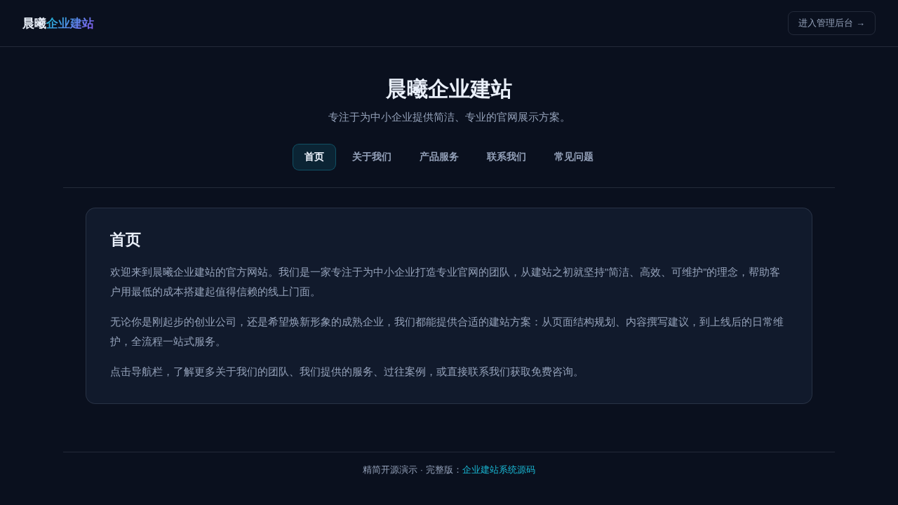

# 企业建站系统（精简开源版）· CMS Lite

**[在线体验（前台）→](https://anna123123123-creator.github.io/cms-lite/)** · **[管理后台 →](https://anna123123123-creator.github.io/cms-lite/admin.html)**

免费开源的企业建站 CMS 系统精简版。这不是截图或原型图，是一个**真实可用**的前后台系统：可配置的页面内容、根据页面发布状态自动生成的导航菜单、后台页面增删改查——都是真功能，纯前端 + `localStorage` 实现，不需要服务器、不需要数据库，克隆下来打开就能用，也适合作为学习或二次开发的起点。

这不是博客系统——没有日期归档、没有评论区，页面是"关于我们 / 产品服务 / 联系方式"这类中小企业官网常见的静态内容页，核心功能是后台可配置的**导航菜单**：管理员决定哪些页面显示在导航栏、显示顺序如何、以及页面是否对外发布。



## 功能

**前台（访客视角）**
- 首页顶部展示站点名称与简介（来自后台"站点设置"）
- 导航栏根据后台页面配置自动生成：只显示"已发布 + 显示于导航"的页面，并按导航顺序排列
- 点击导航项无刷新切换页面内容（hash 路由）
- 未发布页面即使直接输入网址 hash 访问也会显示"页面不存在"，而不是泄露内容——这一校验在页面查找逻辑里强制执行，不只是简单地从导航里隐藏

**后台（管理员视角）**
- 仪表盘：页面总数、已发布页面数、显示于导航的页面数，以及按更新时间排序的最近更新列表
- 页面管理：新增、编辑、删除页面（标题、Slug、正文内容、导航顺序、是否显示于导航、是否发布），Slug 唯一性校验，重复会被拒绝并给出提示
- 站点设置：编辑网站名称、简介、联系电话与邮箱，保存后前台下次访问立即生效

## 试用方法

克隆下来，直接用浏览器打开 `index.html`，或用静态文件服务器跑起来：

```bash
python3 -m http.server 8000
```

前台在 `index.html`，后台在 `admin.html`。所有数据存在浏览器的 `localStorage` 里（`cms_lite_data_v1` 这个 key），后台侧边栏有"重置示例数据"按钮可以随时清空重来。

## 技术说明

没有用任何框架或构建工具，纯原生 HTML/CSS/JavaScript，一共 5 个文件：`data.js`（数据层，负责 localStorage 读写和种子数据）、`index.html` + `script.js`（前台）、`admin.html` + `admin.js`（后台）。因为是纯前端 Demo，数据只存在当前浏览器里，不同设备/浏览器之间不会同步，也没有登录鉴权——真实生产系统需要一个后端 API + 数据库来替换 `data.js` 里的存储层，并补上多管理员账号权限体系和自定义域名绑定，才能真正对外上线。

## 协议

MIT，随便怎么用都行。

## 需要定制版？

这个工具免费开源、可以直接用。如果你需要的是**改造成适合自己业务的版本**——换品牌、改字段、加功能、接后端或数据库——我可以做。

- **交付周期**：3–10 个工作日
- **交付内容**：完整源码（不加密、可自行二次开发）+ 在线地址 + 部署说明
- **已有 49 套现成系统**可直接改造，覆盖电商、教育、门店、内容、跨境等行业：[全部清单与在线演示](https://inzyxuashop.com)

把你的需求发给我，24 小时内回复可行性与报价：**evcdecd@gmail.com**
